# Защо комплексни пазари?

--

## Два базисни факта:

--

Електрическата енергия не може да се съхранява в "икономични" мащаби.

--

- Това е факт на настоящето, но днес нищо не гарантира, че няма да бъде и факт на бъдешето.

--

Потреблението на енергия винаги е обусловено.

--

- Ние използваме електрическа енергия за стоките и услугите, чието предоставяне изиксва употребата й. 

---
class: inverse, center, middle

# Тези факти са в основата на това, че пазарите на електрическа енергия са различни от пазарите на потребителски стоки

---

# Основни икономически характеристики

--

1. Равенство между търсенето и предлагането в реално време.

--

2. Ограничено измерване в реално време.

--

3. Липса на налагане на изпълнението на договореностите

--

4. Циклична вариация на търсенето

---

# Елементи на пазара

Доставената до крайните потребители електрическа енергия, освен производството ѝ, включва група от услуги. 

--

- услугите по доставка, т.е. за пренос и разпределение;

--

- слугите за балансиране на мрежата и т. нар „допълнителни услуги“;

--

Всяка от тези услуги се предоставя от отделен пазар със свои собствени специфики и регулация.

--

Затова, ако се говори за един общ пазар, обхващащ цялата индустрия, този пазар по необходимост е комплексен и съдържа елементите, съответстващи на отделните услуги, и връзките между тях.
---
# Елементи на пазара

--

### Хоризонтални

--

- Пазарите „Ден напред“ и „В рамките на деня“;
- пазарите за двустранни договори;
- за енергия за балансиране и представянето на т. нар. „допълнителни услуги“;
- гарантирането на сигурност на доставките, което е публично благо и обикновено се предоставя от системния оператор.

--

### Вертикални

--

- Производството, пазарите на едро, на които участват производителите;

- осигуряването на права за пренос през мрежите и предоставянето на мрежови услуги;

- пазарите на дребно, които включват доставките и предоставянето на услуги за крайните потребители.

---
class: inverse, center, middle

# Това беше трудната част. Сега може да гледаме хубави изображения.

---
# Месечно потребление и средна месечна температура

.center[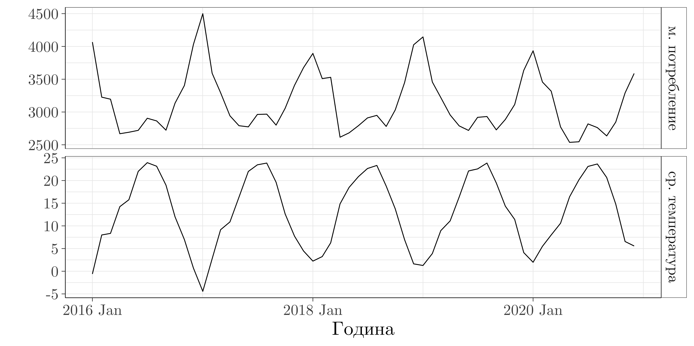]

--
- Вижда се, че и двете имат циклична динамика и са корелирани.

---
# Връзка между месечното потребление и температурата

.center[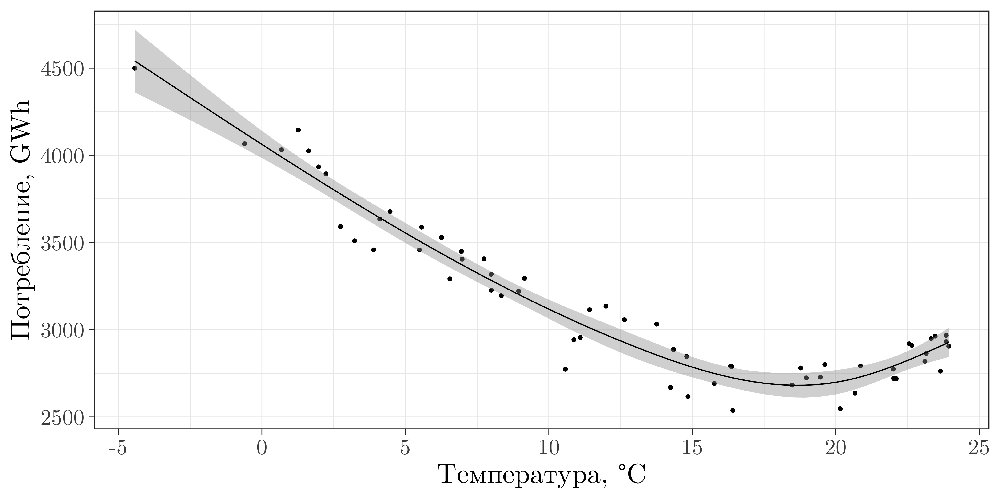]

--
- Потреблението нараства с намаляване на температурата.

---
# Можем да визуализираме и потреблението по месеци

.center[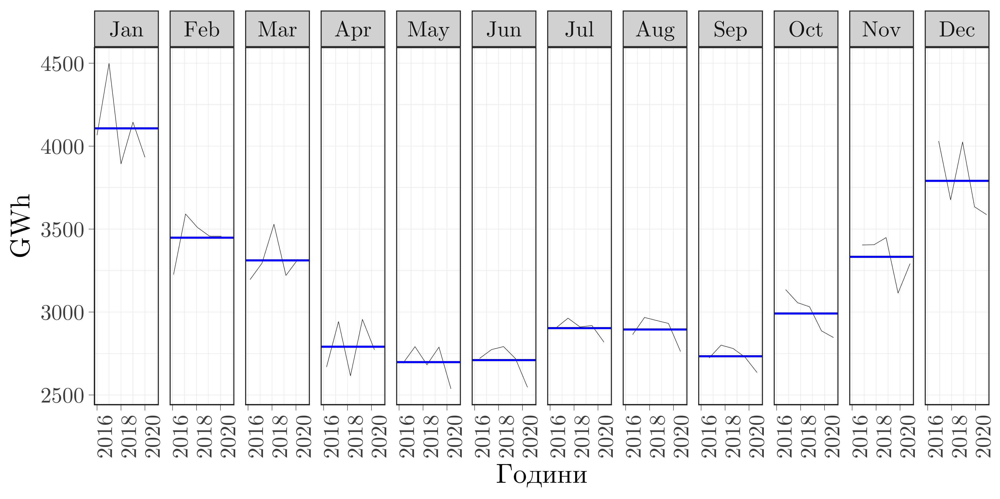]

--
- Това показва, че то е циклично.

---
# Сезонно декомпозиране на потреблението

.center[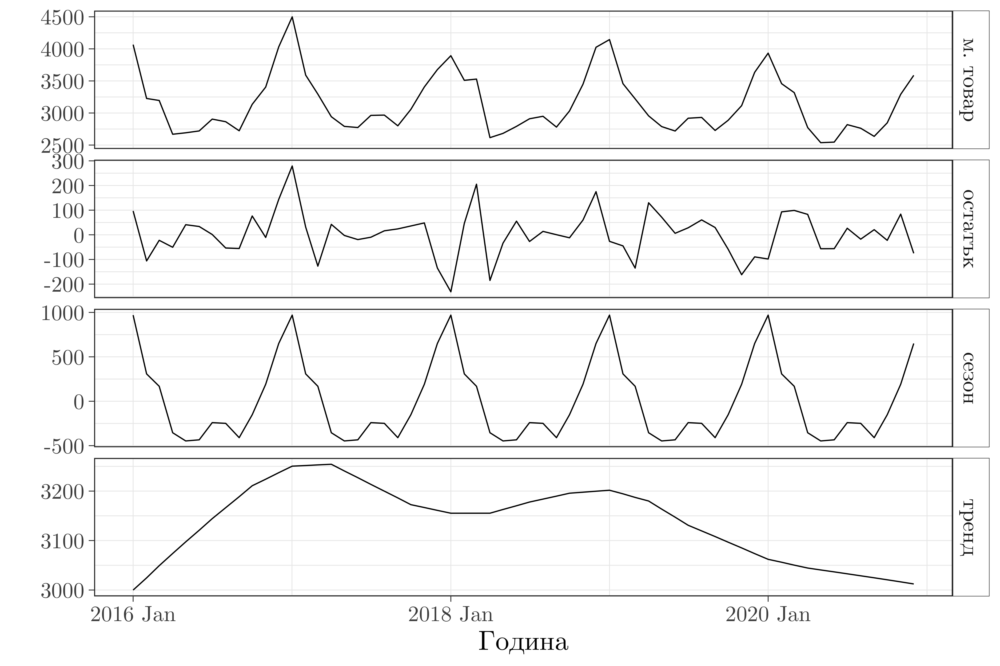]
---

class: inverse, center, middle

# Анализът на месечни данни не е толкова сложен, защото имаме само един цикъл. Нека видим почасовите данни.

---
# Данни за товара за всеки час

.center[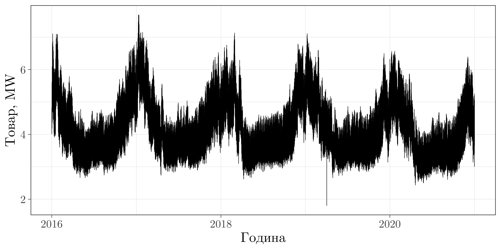]

--
- Вижда се, че това е по-сложен процес.

---
# Товар и температура

.center[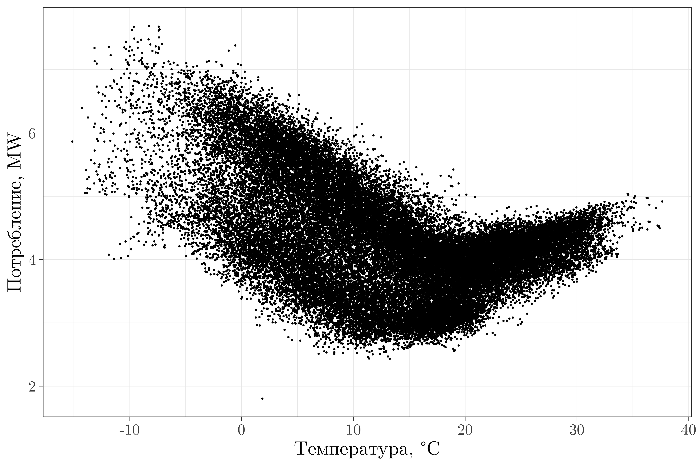]

---
# Потреблението по часове и дни

.center[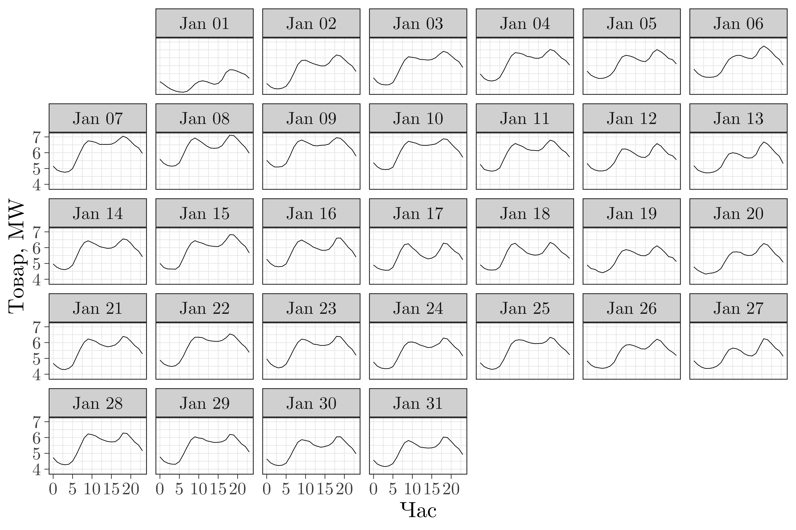]

---
# Потреблението по часове и дни

.center[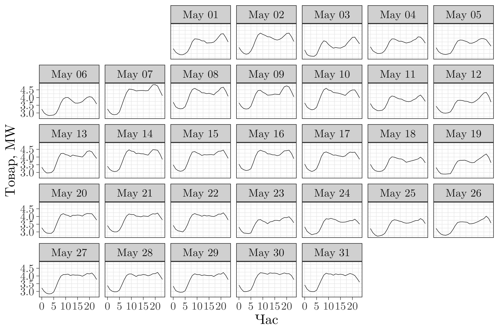]

---

# Потреблението по часове и дни

.center[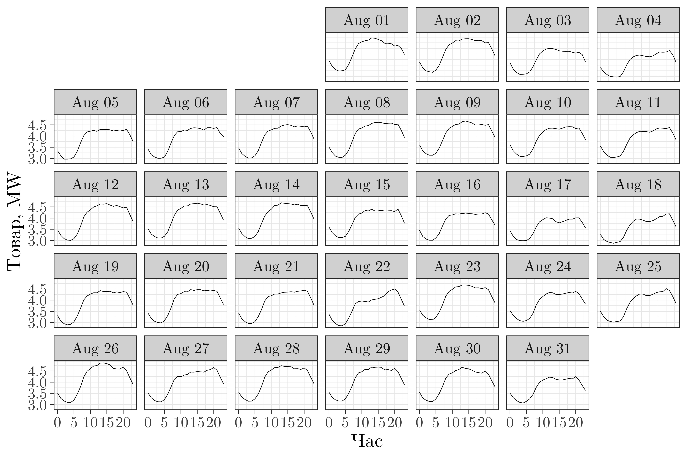]

---
class: inverse, center, middle

# Ами самите пазари?

---
# Можем да кажем нещо много важно за тях

.center[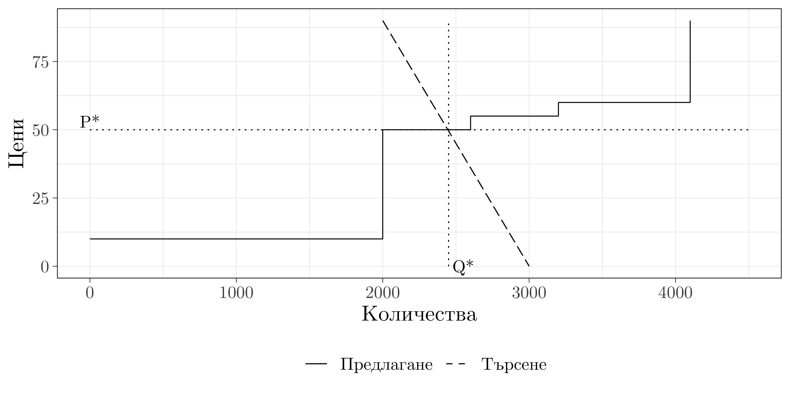]

--
- Това е системната пределна цена (system marginal price).
---

# Какво става, когато целият наличен капацитет е включен?

.center[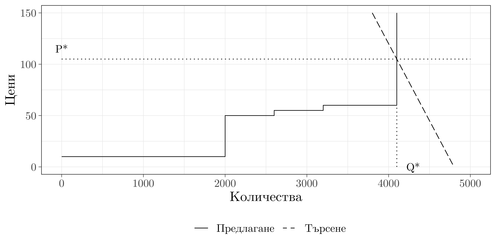]

--
- Теоретично, цената е безкрайна.
---

# Какво става, когато имаме употреба на пазарна сила?

.center[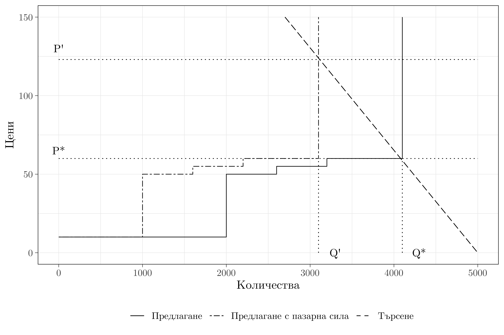]

---

# Какво става, когато имаме употреба на пазарна сила?

.center[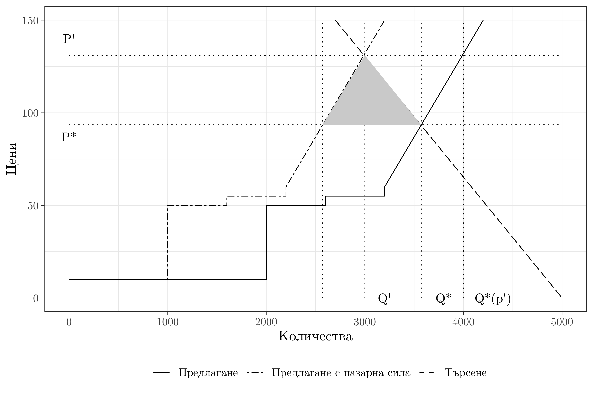]

---

background-image: url(pippin.jpg)
background-size: contain
background-position: 50% 50%
class: center, bottom, inverse

# You only live once!

---

class: center, middle

# Благодаря!

Слайдовете са създадени с пакета [**xaringan**](https://github.com/yihui/xaringan), с помощта на [remark.js](https://remarkjs.com), [**knitr**](https://yihui.org/knitr/), и [R Markdown](https://rmarkdown.rstudio.com).
